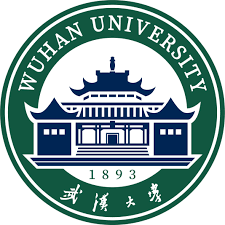

## Biography

I am a second-year master's student, set to graduate in the summer of 2025, from [Academy for Advanced Interdisciplinary Studies (AAIS)](http://www.aais.pku.edu.cn/), [Peking University](https://www.pku.edu.cn/). 

My research interest includes computer vision and multimodal learning.

I am very fortunate to be advised by [Prof. Yuxin Peng](http://39.108.48.32/mipl/pengyuxin/) of [MIPL Lab](http://39.108.48.32/mipl/home/) from [Wangxuan Institute of Computer Technology](https://www.wict.pku.edu.cn/), Peking University.

You can find my CV here: [Yanzhe Chen's Curriculum Vitae](../assets/CV_CHENYANZHE.pdf).

[Email](mailto:chenyanzhe@stu.pku.edu.cn) / [Github](https://github.com/ChenAnno) / [Wechat](../images/wechat.png)

## Experience

- **Postgraduate Student**    
   MIPL Lab, Peking University (PKU)   
  August 2022 - July 2025    
  Mainly focusing on multimodal retrieval and generation, particularly video-to-image retrieval, composed image retrieval, and virtual try-on generation in e-commerce scenarios. Relevant work has been published in AAAI, ACM MM, and TOMM.  
  Advisor: Yuxin Peng

- **Intern**    
   Multimedia Understanding Team (MMU), Kwai Technology   
  December 2022 - June 2025   
  Independently completed the Kuaishou short video fine-grained product representation project, implemented in  Kuaishou app's search/recommendation scenarios , significantly boosting Gross Merchandise Volume (GMV).

- **Graduate Researcher**    
   Wuhan University (WHU)   
  August 2018 - July 2022    
  GPA: 3.96/4.0, ranked 1st out of 272 in Computer Science and Technology. Focused on medical image analysis, awarded Wuhan University Outstanding Thesis.    
  Advisor: Dengyi Zhang  

## Selected Awards

- China National Scholarship, 2020.

- Champion of the Disaster Scene Description and Indexing Task at TREC 2022.

- Wuhan University Outstanding Thesis and Wuhan University Outstanding Graduate honors, 2022.

